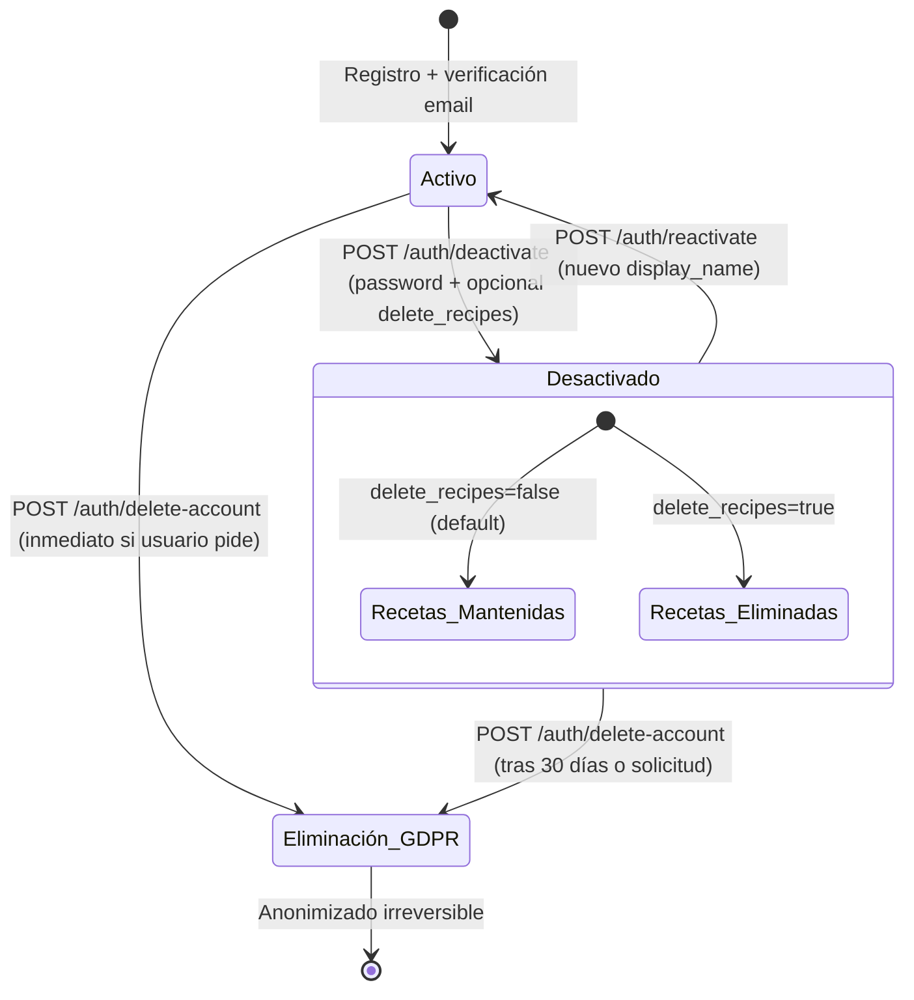

# Especificación de Autenticación y Autorización

## Flujo de Autenticación

### Proveedores soportados (MVP)
1. **Email + Contraseña** (own)
2. **OAuth 2.0: Google** (SHOULD)
3. **OAuth 2.0: GitHub** (SHOULD)

### Tokens
| Token | Tipo | Expiración | Almacenamiento | Uso |
|-------|------|------------|----------------|-----|
| Access Token | JWT (HS256) | 15 min | Memoria (JS variable) | Authorization header `Bearer <token>` |
| Refresh Token | JWT (HS256) con `jti` | 30 días | HttpOnly cookie (Secure, SameSite=Lax, path=/api/v1/auth/refresh) | POST `/auth/refresh` → nuevo access + refresh rotado |
| Email Verification | JWT (HS256) | 24 h | Email link | **[v2]** GET `/auth/verify-email?token=...` |
| Password Reset | JWT (HS256) | 1 h | Email link | **[v2]** POST `/auth/reset-password` |

> **Nota**: la spec original definía access RS256 + refresh *opaque*. El MVP
> implementa **HS256 + refresh JWT** (ver `docs/decisions/ADR-000-source-of-truth.md`).

### JWT Claims (Access Token)
```json
{
  "sub": "uuid-usuario",
  "type": "access",
  "iat": 1234567890,
  "exp": 1234567890,
  "jti": "unique-token-id"
}
```
> Los claims `email`, `provider` y `name` **no** se incluyen hoy (se obtienen
> de la BD al resolver la dependencia de auth). El claim `role` se reserva para
> la auth admin **[v2]**. El refresh token usa la misma forma con `type: "refresh"`.

## Endpoints de Auth

| Método | Ruta | Descripción | Auth |
|--------|------|-------------|------|
| POST | `/auth/register` | Registro email + password | Público |
| POST | `/auth/login` | Login email + password | Público |
| POST | `/auth/oauth/google` | Iniciar OAuth Google **[v2]** | Público |
| GET | `/auth/oauth/google/callback` | Callback Google **[v2]** | Público |
| POST | `/auth/oauth/github` | Iniciar OAuth GitHub **[v2]** | Público |
| GET | `/auth/oauth/github/callback` | Callback GitHub **[v2]** | Público |
| POST | `/auth/refresh` | Renovar access token (cookie refresh) | Refresh token |
| POST | `/auth/logout` | Revocar refresh token | Access token |
| POST | `/auth/forgot-password` | Solicitar reset email | Público |
| POST | `/auth/reset-password` | Confirmar reset con token | Público |
| GET | `/auth/verify-email` | Verificar email con token **[v2]** | Público |
| POST | `/auth/resend-verification` | Reenviar email verificación **[v2]** | Access token |
| GET | `/auth/me` | Perfil usuario actual | Access token |
| PATCH | `/auth/me` | Actualizar perfil (name, avatar) | Access token |
| POST | `/auth/change-password` | Cambiar password (usuario logueado) | Access token |
| DELETE | `/auth/me` | Eliminar cuenta (soft delete + anonimizar) | Access token |

## Esquema de Base de Datos (resumen)

Ver `docs/domain/entities.md` → tabla `usuario`.

Campos clave:
- `provider`: 'email' | 'google' | 'github'
- `provider_id`: ID del proveedor OAuth (unique por provider)
- `password_hash`: NULL para usuarios OAuth
- `is_active`: boolean (DEFAULT true) — baja lógica
- `last_login_at`: timestamptz nullable
- `deactivated_at`: timestamptz nullable
- `deletion_requested_at`: timestamptz nullable

## Reglas de Negocio Auth

| ID | Regla |
|----|-------|
| RB-AUTH-01 | Email único global (único usuario por email, independientemente del provider) |
| RB-AUTH-02 | Un usuario puede vincular múltiples providers OAuth a la misma cuenta (mismo email) |
| RB-AUTH-03 | Password: mínimo 8 chars, 1 mayúscula, 1 minúscula, 1 número, 1 especial |
| RB-AUTH-04 | Rate limit: 5 intentos login/registro por IP/15 min; 3 reset password por email/hora |
| RB-AUTH-05 | Refresh token: rotación en cada uso (emitir nuevo, revocar anterior); detectar reuso → revocar toda la familia |
| RB-AUTH-06 | Logout: revoca refresh token actual; opcionalmente revoca todos (logout all devices) |
| RB-AUTH-07 | Email verification: requerido antes de permitir login (OAuth = verificado automático) |
| RB-AUTH-08 | Baja lógica: `is_active=false`, anonimiza PII visible, email reservado, recetas/favoritos/visitas/ratings mantenidos (recuperables) |
| RB-AUTH-09 | Reactivación: `is_active=true`, restaura display_name, datos reconectados automáticamente |
| RB-AUTH-10 | Eliminación GDPR: anonimización irreversible, recetas → system user, FKs → NULL |
| RB-AUTH-11 | `last_login_at` actualizado en cada login exitoso |

## Endpoints Adicionales (Baja y Reactivación)

| Método | Ruta | Descripción | Auth |
|--------|------|-------------|------|
| POST | `/auth/deactivate` | Baja lógica (soft delete) con opción `delete_recipes: boolean` **[v2]** | Access token |
| POST | `/auth/reactivate` | Reactivar cuenta (requiere nuevo display_name) **[v2]** | Access token (o magic link) |
| POST | `/auth/delete-account` | Eliminación definitiva GDPR (irreversible) **[v2]** | Access token + confirmación expresa |

### POST `/auth/deactivate` — Baja Lógica
**Request**:
```json
{
  "password": "password_actual",  // confirmación de identidad
  "delete_recipes": false         // true = soft delete recetas + transferir a system user
}
```
**Happy Path (200)**:
```json
{
  "message": "Cuenta desactivada. Tus recetas y datos se conservan para que puedas reactivar tu cuenta en el futuro.",
  "deactivated_at": "2026-09-05T10:30:00Z",
  "recipes_affected": 0
}
```
**Bad Path (400/401/403)**:
- 401: "Contraseña incorrecta"
- 403: "Cuenta ya desactivada"
- 400: "Parámetros inválidos"

### POST `/auth/reactivate` — Reactivación
**Request**:
```json
{
  "display_name": "Mi Nombre Nuevo",  // obligatorio, el anterior se anonimizó
  "avatar_url": "https://..."         // opcional
}
```
**Happy Path (200)**:
```json
{
  "message": "Cuenta reactivada exitosamente. Bienvenido de nuevo.",
  "user": { "id": "...", "email": "...", "display_name": "Mi Nombre Nuevo", "is_active": true }
}
```
**Bad Path (400/403/404)**:
- 403: "Cuenta no está desactivada"
- 404: "Usuario no encontrado"
- 400: "display_name requerido"

### POST `/auth/delete-account` — Eliminación GDPR
**Request**:
```json
{
  "password": "password_actual",
  "confirmation": "ELIMINAR MI CUENTA"  // confirmación expresa
}
```
**Happy Path (200)**:
```json
{
  "message": "Cuenta eliminada definitivamente. Tus recetas pasaron a 'Usuario eliminado' y ya no pueden asociarse a ti.",
  "deleted_at": "2026-09-05T10:30:00Z"
}
```
**Bad Path (400/401/403)**:
- 401: "Contraseña incorrecta"
- 403: "Confirmación requerida: escribe exactamente 'ELIMINAR MI CUENTA'"
- 400: "Parámetros inválidos"

## Happy Path / Bad Path — Login

### POST `/auth/login`
**Request**: `{ "email": "user@example.com", "password": "Secreto123!" }`

**Happy Path (200)**:
```json
{
  "access_token": "eyJhbGciOiJSUzI1NiIs...",
  "token_type": "Bearer",
  "expires_in": 900,
  "user": { "id": "...", "email": "...", "display_name": "...", "avatar_url": "...", "is_active": true }
}
```
+ Set-Cookie: `refresh_token=xyz; HttpOnly; Secure; SameSite=Lax; Path=/auth/refresh; Max-Age=2592000`

**Bad Path**:
| Código | Mensaje | Causa |
|--------|---------|-------|
| 400 | "Email y contraseña requeridos" | Body inválido |
| 401 | "Credenciales inválidas" | Email no existe O password incorrecto (mismo mensaje por seguridad) |
| 403 | "Cuenta desactivada. Contacta soporte para reactivar." | `is_active=false` |
| 403 | "Email no verificado. Revisa tu bandeja de entrada." | `email_verified=false` (solo provider=email) |
| 429 | "Demasiados intentos. Intenta en 15 minutos." | Rate limit excedido |

### POST `/auth/register`
**Request**: `{ "email": "user@example.com", "password": "Secreto123!", "display_name": "Mi Nombre" }`

**Happy Path (201)**:
```json
{
  "message": "Registro exitoso. Hemos enviado un email de verificación a tu correo.",
  "user_id": "...",
  "email_verification_sent": true
}
```

**Bad Path**:
| Código | Mensaje | Causa |
|--------|---------|-------|
| 400 | "Email, password y display_name requeridos" | Body incompleto |
| 400 | "La contraseña debe tener mínimo 8 caracteres, 1 mayúscula, 1 minúscula, 1 número y 1 carácter especial" | Password policy falla |
| 409 | "Este email ya está registrado" | UNIQUE violation |
| 429 | "Demasiados intentos. Intenta en 15 minutos." | Rate limit |

## Flujo de Baja y Reactivación (Diagrama)



## OAuth Flows

### Google
1. Frontend → `GET /auth/oauth/google` → redirect a `https://accounts.google.com/o/oauth2/v2/auth?client_id=...&redirect_uri=...&scope=openid email profile&response_type=code&state=<csrf>`
2. Google → `GET /auth/oauth/google/callback?code=...&state=...`
3. Backend: intercambio `code` → tokens → `userinfo` → upsert usuario por email → emitir JWT pair

### GitHub
1. Frontend → `GET /auth/oauth/github` → redirect a `https://github.com/login/oauth/authorize?client_id=...&redirect_uri=...&scope=read:user user:email&state=<csrf>`
2. GitHub → `GET /auth/oauth/github/callback?code=...&state=...`
3. Backend: intercambio `code` → access token → `GET /user/emails` → primary email → upsert usuario → emitir JWT pair

## Vinculación de Cuentas (Account Linking)

Si usuario existente (email) hace login con OAuth nuevo:
1. Verificar email verificado en proveedor OAuth
2. Si coincide email con usuario existente → vincular provider_id al usuario
3. Si no coincide → crear usuario nuevo (o preguntar al usuario)

## Seguridad Adicional

- **CSRF**: `state` parameter en OAuth + SameSite=Lax en cookies
- **Token binding**: Refresh token hash almacenado en BD (bcrypt), no reversible
- **Device fingerprinting** (opcional): track user-agent/IP para "sesiones activas" UI
- **Breach detection**: Verificar password contra HaveIBeenPwned (k-anonymity) en registro/cambio

## Matriz de Permisos (RBAC simple)

> **Nota**: existe un panel admin separado (proyecto SvelteKit con auth propia),
> pero **sin funciones de moderación**. Solo gestiona categorías y datos.
> Ver `docs/decisions/ADR-000-source-of-truth.md`.

| Acción | Anónimo | Usuario | Autor de receta | Admin (categorías) |
|--------|---------|---------|-----------------|-------------------|
| Ver recetas públicas | ✓ | ✓ | ✓ | ✓ |
| Buscar/filtrar | ✓ | ✓ | ✓ | ✓ |
| Ver detalle receta | ✓ | ✓ | ✓ | ✓ |
| Crear receta | ✗ | ✓ | ✓ | ✓ |
| Editar propia receta | ✗ | ✗ | ✓ | ✓ |
| Borrar propia receta | ✗ | ✗ | ✓ | ✓ |
| Toggle público/privado | ✗ | ✗ | ✓ | ✓ |
| Guardar/quitar favoritos | ✗ | ✓ | ✓ | ✓ |
| Calificar/reseñar | ✗ | ✓ | ✓ | ✓ |
| Editar propia calificación | ✗ | ✓ | ✓ | ✓ |
| Generar receta IA | ✗ | ✓ | ✓ | ✓ |
| Modo cocinando | ✓ | ✓ | ✓ | ✓ |
| Ver métricas propias | ✗ | ✓ | ✓ | ✓ |
| Admin: CRUD categorías | ✗ | ✗ | ✗ | ✓ |
| Admin: métricas globales | ✗ | ✗ | ✗ | ✓ |

## Checklist de Implementación

- [x] Endpoints registro/login/refresh/logout
- [x] Middleware auth (validate JWT, attach user a request)
- [x] Password hashing (bcrypt directo)
- [x] Refresh token rotación (nuevo par en cada refresh) + `jti`
- [x] Bootstrap admin por variables de entorno
- [x] Tests de integración de auth (`backend/tests/test_auth.py`)
- [ ] Middleware ownership explícito (hoy la verificación es por consulta `author_id == user.id`)
- [ ] OAuth Google + GitHub **[v2]**
- [ ] JWT RS256 con par de claves **[v2]**
- [ ] Refresh token opaque + detección de reuso por familia **[v2]**
- [ ] Rate limiting en auth endpoints **[v2]**
- [ ] Email verification flow (envío) **[v2]**
- [ ] Password reset flow real **[v2]**
- [ ] Password strength validation (complejidad) **[v2]**
- [ ] Account linking (email match) **[v2]**
- [ ] Soft delete + anonimización **[v2]**