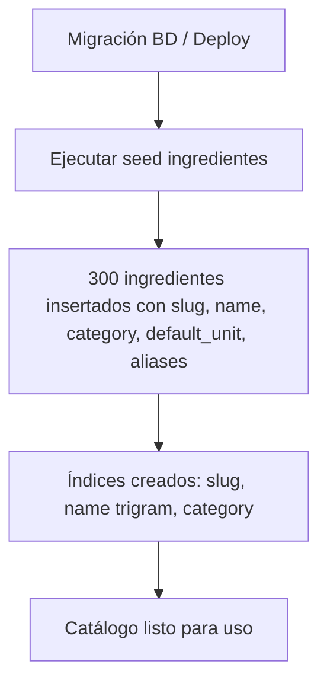

# Caso de Uso: Catálogo de Ingredientes y Selector en Recetas

**ID**: UC-INGREDIENTS-001  
**Actor principal**: Usuario (logueado, creando/editando receta) + Sistema (seed data)  
**Precondición**: Tabla `ingrediente` poblada con 300 items seed  
**Objetivo**: Gestionar catálogo normalizado y permitir selección consistente en recetas

---

## Flujo Principal: Seed Data (Sistema)



---

## Flujo Principal: Usuario selecciona ingredientes en receta

```mermaid
flowchart TD
    A[Usuario en formulario Crear/Editar Receta] --> B[Click "Agregar ingrediente"]
    B --> C[Se abre selector tipo combobox/autocomplete]
    C --> D[Usuario escribe: "pol"]
    D --> E[API GET /api/ingredients/autocomplete?q=pol]
    E --> F[Sugerencias: Pollo, Pollo - pechuga, Aceite de oliva...]
    F --> G{Usuario selecciona existente?}
    G -- Sí --> H[Se agrega chip: "Pollo (g)"]
    G -- No --> I[Click "Crear nuevo ingrediente"]
    I --> J[Modal: nombre, categoría, unidad por defecto]
    J --> K[POST /api/ingredients → guarda en catálogo]
    K --> H
    H --> L[Usuario ingresa cantidad: 200]
    L --> M[Usuario selecciona unidad: g (default) / kg / unidad...]
    M --> N[Opcional: notas "picado fino"]
    N --> O[Click "Guardar ingrediente"]
    O --> P[JSONB ingredients agrega: {ingredient_id, amount, unit, notes}]
    P --> Q{Más ingredientes?}
    Q -- Sí --> B
    Q -- No --> R[Formulario receta listo para submit]
```

---

## Pasos Detallados

### 1. Seed Data Inicial (Sistema)
- **Acción**: Migración/Deploy ejecuta `INSERT INTO ingrediente ... 300 rows`
- **Datos**: slug, name, category, default_unit, aliases
- **Categorías**: proteina, verdura, fruta, lacteo, grano, condimento, grasa, otro
- **Unidades**: g, kg, ml, l, unidad, cucharada, cucharadita, taza, pizca
- **Ejemplos**: 
  - `pollo` → "Pollo", proteina, g, {pechuga, suprema}
  - `aceite-oliva` → "Aceite de oliva", grasa, ml, {AOVE}
  - `tomate` → "Tomate", verdura, g, {tomate pera, cherry}

### 2. Autocompletado en Selector
- **Acción**: Usuario escribe mínimo 2 caracteres en input ingredientes
- **Sistema**: 
  - Debounce 200ms
  - `GET /api/ingredients/autocomplete?q=<query>&limit=10`
  - Query: `WHERE (slug LIKE 'query%' OR name ILIKE 'query%') AND is_active=true ORDER BY usage_count DESC, name`
- **Resultado**: Lista sugerencias con nombre, categoría, unidad por defecto
- **UI**: Dropdown con chips seleccionables, muestra categoría + unidad

### 3. Selección de Ingrediente Existente
- **Acción**: Usuario click en sugerencia "Pollo"
- **Sistema**: 
  - Agrega chip visual: "Pollo" + input cantidad + select unidad (default: g)
  - Chip removible (✕)
  - Cantidad: number input > 0, step 0.5 o 1 según unidad
  - Unidad: select con default_unit del ingrediente + alternativas compatibles

### 4. Creación de Ingrediente Nuevo (desde selector)
- **Acción**: Usuario escribe "tofu ahumado" → no existe → click "Crear 'tofu ahumado'"
- **Sistema**: Modal con:
  - Nombre: "Tofu ahumado" (prefill)
  - Categoría: select (proteina, verdura, etc.) — default: proteina
  - Unidad por defecto: select (g, unidad, etc.) — default: g
  - Aliases: textarea opcional (sinónimos, uno por línea)
- **Validación**: slug único, name único, categoría válida, unidad válida
- **POST**: `/api/ingredients` → `201 Created` → retorna ingredient_id
- **Resultado**: Ingrediente disponible inmediatamente en autocomplete (usage_count=1)

### 5. Agregado a Receta (JSONB)
- **Estructura final en `receta.ingredients`**:
```json
[
  {"ingredient_id": "uuid-pollo", "amount": 500, "unit": "g", "notes": "en cubos"},
  {"ingredient_id": "uuid-cebolla", "amount": 1, "unit": "unidad", "notes": "picada fina"},
  {"ingredient_id": "uuid-aceite-oliva", "amount": 50, "unit": "ml", "notes": null}
]
```
- **Validación submit**: Cada ingredient_id existe en BD y is_active=true
- **Unidad**: Debe ser compatible (warning si distinta a default_unit)

### 6. Búsqueda por Ingrediente (Usuario final)
- **Acción**: En búsqueda, usuario selecciona chips ingredientes: "pollo", "tomate"
- **Sistema**: 
  - Query combina: catálogo exacto (`ingredient_id IN (...)`) + nombre parcial (`ingredients.name ILIKE '%pollo%'`)
  - Lógica OR entre ingredientes seleccionados
  - AND global con categoría, tags, texto libre

---

## Flujos Alternativos

### AF-01: Ingrediente desactivado en catálogo
- **Condición**: `ingrediente.is_active=false` (admin desactivó)
- **Sistema**: 
  - No aparece en autocomplete
  - En recetas existentes: se muestra con badge "Ingrediente no disponible"
  - Al editar receta: sugiere reemplazo con ingrediente activo similar (misma categoría)

### AF-02: Usuario ingresa cantidad inválida
- **Condición**: amount ≤ 0 o no numérico
- **Sistema**: Inline error "Cantidad debe ser > 0", disable submit

### AF-03: Unidad incompatible
- **Condición**: Usuario selecciona "unidad" para ingrediente con default_unit="g" (ej: harina)
- **Sistema**: Warning toast "La unidad habitual para Harina es 'g'. ¿Seguro que quieres 'unidad'?" — permite pero advierte

### AF-04: Ingrediente duplicado en receta
- **Condición**: Usuario agrega "Pollo" dos veces
- **Sistema**: Merge automático: suma amounts, concatena notes, mantiene primer ingredient_id

### AF-05: Error de red en autocomplete
- **Condición**: API falla
- **Sistema**: Fallback a búsqueda local en caché (últimos 50 usados) + toast "Modo offline: sugerencias limitadas"

---

## Reglas de Negocio Aplicadas

| Regla | Aplicación |
|-------|------------|
| RB-ING-01 | Seed 300 items, categorías, unidades, aliases |
| RB-ING-02 | JSONB estructura `{ingredient_id, amount, unit, notes}` + validación FK |
| RB-ING-03 | Autocomplete prefix + ranking usage_count; crear nuevo desde UI |
| RB-ING-04 | Búsqueda: catálogo exacto + nombre parcial ILIKE; OR entre ingredientes |
| RB-02 | Tags e ingredientes ambos normalizados con slug + autocomplete |
| RB-03 | Filtro ingredientes combina con categoría, tags, texto (AND global) |

---

## Criterios de Aceptación (AC)

| ID | Criterio | Verificación |
|----|----------|--------------|
| AC-01 | Seed 300 ingredientes insertados correctamente | Migración BD + `SELECT count(*) FROM ingrediente` = 300 |
| AC-02 | Autocomplete responde < 100ms p95 | k6 load test |
| AC-03 | Sugerencias ordenadas por usage_count + nombre | Unit test |
| AC-04 | Crear nuevo ingrediente desde selector funciona | Cypress e2e |
| AC-05 | JSONB receta valida ingredient_id existe y activo | Unit test + integration test |
| AC-06 | Búsqueda por ingrediente combina catálogo + parcial | Integration test |
| AC-07 | Unidades compatibles sugeridas por defecto | Unit test |
| AC-08 | Accesibilidad: autocomplete navegable teclado, ARIA | axe-core CI |

---

## Métricas de Éxito (UC Level)

| Métrica | Target |
|---------|--------|
| % ingredientes usados desde catálogo (vs libre) | > 95% |
| Tiempo autocomplete → selección | < 2 s |
| Ingredientes nuevos creados por usuarios / mes | < 5% del total (catálogo cubre mayoría) |
| Errores validación ingredient_id en submit receta | 0 |

---

## Dependencias Técnicas

| Componente | Responsabilidad |
|------------|-----------------|
| `GET /api/ingredients/autocomplete` | Prefix search + ranking, debounce, caché Redis |
| `POST /api/ingredients` | Validación slug único, categoría, unidad, aliases |
| `IngredientSelector` component | Combobox, chips, cantidad, unidad, notas, crear nuevo |
| `RecipeForm` | Validación JSONB ingredients al submit |
| `SearchIngredients` | Query builder: catálogo exacto + ILIKE parcial |

---

## Referencias

- **Requisitos**: RF-12.1 a RF-12.8
- **Reglas**: RB-ING-01 a RB-ING-04, RB-02, RB-03
- **Dominio**: `docs/domain/domain-model.md` (Ingrediente), `docs/domain/data-model.md` (tabla + seed)
- **Especs SDD**: `docs/specs/` (delta spec cuando se implemente)

---

## Estado de Implementación

- ✅ **Seed**: **317** ingredientes idempotentes por slug (`backend/app/core/ingredients_seed.py`),
  marcados `validated_by_admin=true` (no caen en la cola de pendientes del admin).
- ✅ **Autocomplete**: `GET /api/v1/ingredients?query=` (público), ordenado por nombre.
- ✅ **Alta desde el selector**: `POST /api/v1/ingredients` (auth) crea un ingrediente
  **pendiente** de validación (o devuelve el existente si el slug coincide); el
  form de receta lo usa para el alta manual y queda referenciado por `ingredient_id`.
- ✅ **JSONB** `{ingredient_id, amount, unit, notes}`; el detalle resuelve el nombre
  desde el catálogo.
- ⚠️ **Desviaciones**: no hay columna `usage_count` en ingredientes (el orden es por
  nombre, no por uso); la búsqueda por ingrediente es por `ingredient_id` exacto
  (la coincidencia parcial por nombre queda **[v2]**).
