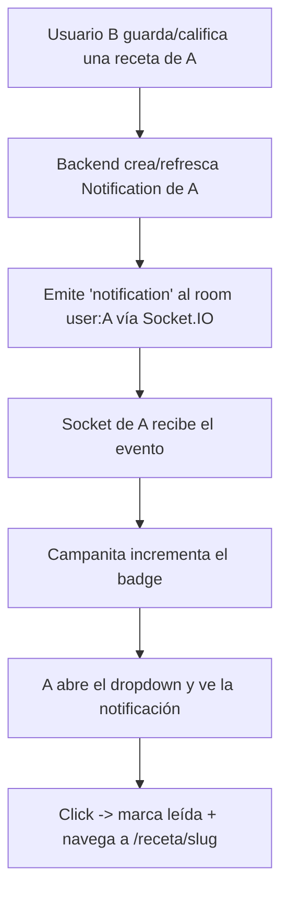

# Caso de Uso: Notificaciones en Tiempo Real

**ID**: UC-NOTIF-001
**Actor principal**: Autor de una receta (usuario logueado)
**Precondición**: El autor tiene al menos una receta pública y otro usuario interactúa con ella
**Objetivo**: Enterarse en el momento en que alguien guarda o califica su receta

---

## Flujo Principal

---

## Pasos Detallados

1. **Reconexión / auth**: al iniciar sesión, el cliente abre un socket con
   `auth.token` (JWT de acceso). El servidor valida el token, guarda la sesión
   y une el socket al room `user:<id>`. Un socket sin token válido se rechaza.
2. **Disparo**: al `POST /favorites/{recipe_id}` o `POST /ratings/{recipe_id}`,
   el backend crea o refresca una `Notification` para el autor y, tras el
   commit, emite `notification` al room del autor. Nunca se auto-notifica.
3. **Badge**: el cliente incrementa el contador de no leídas y lo muestra en la
   campanita (`IconBellFilled`).
4. **Dropdown**: muestra las últimas 20 con actor, tipo, receta y tiempo relativo.
5. **Lectura**: click en una notificación → `POST /notifications/{id}/read` +
   navegación a `/receta/<slug>`.
6. **Borrado**: `DELETE /notifications/{id}` (individual) o
   `DELETE /notifications` (todas). "Marcar leídas" usa `POST /notifications/read-all`.

---

## Reglas de Negocio Aplicadas

| Regla | Aplicación |
|-------|------------|
| — | **Sin auto-notificación**: el actor nunca es el destinatario |
| — | **Dedupe**: (destinatario, actor, receta, tipo) es único; repetir refresca |
| RB-05 | Favorito (`type="favorite"`) |
| RB-06 | Calificación (`type="rating"`, con `detail.score`) |

---

## Contrato técnico

### Modelo `Notification`
`id`, `user_id` (destinatario = autor), `actor_id`, `type` (`favorite`|`rating`),
`recipe_id`, `detail` (JSONB), `is_read`, `created_at`.
Unique: `(user_id, actor_id, recipe_id, type)`.

### REST (`/api/v1/notifications`, auth)
| Método | Ruta | Descripción |
|--------|------|-------------|
| GET | `/notifications` | Lista paginada + `unread_count` |
| GET | `/notifications/unread-count` | Solo el contador |
| POST | `/notifications/{id}/read` | Marcar una como leída |
| POST | `/notifications/read-all` | Marcar todas como leídas |
| DELETE | `/notifications/{id}` | Borrar una |
| DELETE | `/notifications` | Borrar todas |

### Tiempo real
- Servidor: `app/realtime/server.py` (`socketio.AsyncServer`), events
  `connect` (auth + join room) y `disconnect`; helper `emit_notification`.
- `app/services/notifications.py::notify_recipe_author` centraliza el alta.
- ASGI app: `app.main:socket_app` (`socketio.ASGIApp(sio, other_asgi_app=app)`).
- Frontend: `$lib/stores/notifications.ts` gestiona el estado y el socket;
  `$lib/components/ui/NotificationBell.svelte` es la UI del navbar.
- Proxy: vite reenvía `/socket.io` (con `ws: true`) al backend.

---

## Estado de Implementación

- ✅ Eventos de favorito y calificación → notificación en tiempo real.
- ✅ Campanita con badge, dropdown, marcar leída + navegar, borrar una/todas.
- ✅ Rechazo de sockets sin token; isolation por room `user:<id>`.
- 🔲 Emails/push (fuera de alcance; ver `docs/vision/scope.md`).
- 🔲 Notificar por respuestas/comentarios (no aplica: sin comentarios en MVP).
