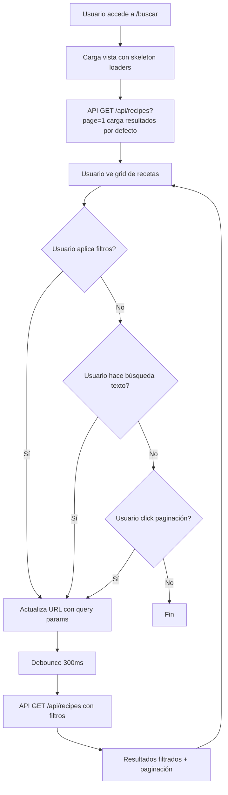

# Caso de Uso: Búsqueda Unificada de Recetas

**ID**: UC-SEARCH-001  
**Actor principal**: Usuario (logueado o anónimo)  
**Precondición**: Existen recetas públicas en el sistema  
**Objetivo**: Encontrar recetas combinando múltiples criterios de filtro

---

## Flujo Principal

---

## Pasos Detallados

### 1. Carga Inicial
- **Acción**: Usuario navega a `/buscar` (o `/` redirige)
- **Sistema**: 
  - Renderiza layout: sidebar filtros + grid resultados
  - Muestra skeleton loaders en grid (8 tarjetas)
  - Llama `GET /api/recipes?page=1&sort=recent`
- **Resultado**: Primer página de recetas públicas ordenadas por fecha descendente

### 2. Aplicar Filtro de Categoría
- **Acción**: Usuario selecciona una categoría en sidebar (radio group)
- **Sistema**:
  - Actualiza URL: `?category=postre&page=1`
  - Llama `GET /api/recipes?category=postre&page=1&sort=recent`
  - Sidebar muestra chip activo "Postre ✕" removible
- **Regla**: Solo una categoría a la vez (RB-01, RB-03)

### 3. Aplicar Filtro de Tags
- **Acción**: Usuario escribe en input "Tags" → autocomplete sugiere "vegano", "vegetariano"
- **Sistema**:
  - Usuario selecciona "vegano" → chip "Vegano ✕"
  - Usuario escribe "sin" → sugiere "sin-tacc" → selecciona
  - URL: `?category=postre&tags=vegano,sin-tacc&page=1`
  - API: `GET /api/recipes?category=postre&tags=vegano,sin-tacc&page=1`
- **Regla**: Múltiples tags = AND (receta debe tener TODOS) (RB-03)

### 4. Búsqueda por Texto Libre
- **Acción**: Usuario escribe "brownie" en input búsqueda principal
- **Sistema**:
  - Debounce 300ms
  - URL: `?category=postre&tags=vegano,sin-tacc&query=brownie&page=1`
  - API: búsqueda `ILIKE` en `title` + `description` (OR)
- **Regla**: Combina con filtros existentes (AND global) (RB-03)

### 5. Filtro por Ingredientes (Coincidencia Parcial)
- **Acción**: Usuario abre selector "Ingredientes" → escribe "almendra" → selecciona
- **Sistema**:
  - Chip "Almendra ✕"
  - URL: `?category=postre&tags=vegano,sin-tacc&q=brownie&ingredients=almendra&page=1`
  - API: `ingredients @> [{"ingredient_id": "..."}]` — OR entre ingredientes seleccionados
  - **Pendiente [v2]**: coincidencia parcial por nombre (ILIKE/trigram)
- **Regla**: Combina con todo (AND global) (RB-03, RB-16)

### 6. Cambiar Ordenamiento
- **Acción**: Usuario selecciona "Mejor calificadas" en dropdown
- **Sistema**:
  - URL añade `&sort=top_rated`
  - API re-ejecuta con `ORDER BY avg_rating DESC` (desempate por `rating_count` pendiente **[v2]**)

### 7. Paginación / Infinite Scroll
- **Acción**: Usuario hace scroll cerca del final
- **Sistema**:
  - Offset: `GET /api/v1/recipes?page=N&limit=M` (cursor-based queda **[v2]**)
  - Append resultados al grid (no replace)
  - Skeleton loader solo en nuevos items

### 8. Click en Receta → Detalle
- **Acción**: Usuario click tarjeta receta
- **Sistema**:
  - Navega a `/receta/<slug>` (SEO-friendly, ej: `/receta/tortilla-de-patatas`, o `...-2` si colisiona)
  - Registra visita (ver UC-VISIT-001)
  - Muestra detalle completo

### 9. Limpiar Filtros
- **Acción**: Usuario click "Limpiar todo" o remueve chips individuales
- **Sistema**: Remueve params correspondientes de URL, recarga página 1

---

## Flujos Alternativos

### AF-01: Búsqueda sin resultados
- **Condición**: API devuelve 0 resultados
- **Sistema**: 
  - Muestra empty state ilustrado: "No hay recetas con esos filtros"
  - Sugerencias: "Prueba quitar algún filtro", "Busca 'pollo'", "Explora categoría Postre"
  - Botones rápidos: "Quitar tags", "Quitar ingredientes", "Ver todas"

### AF-02: Usuario anónimo intenta guardar/calificar
- **Condición**: Click "Guardar" o estrellas sin sesión
- **Sistema**:
  - Modal login/registro (prefill return_to=/receta/:id)
  - Tras login exitoso → ejecuta acción original (guardar/calificar)

### AF-03: Autocompletado tag crea tag nuevo
- **Condición**: Usuario escribe "low-carb" → no existe → Enter
- **Sistema**:
  - Crea tag `slug: low-carb`, `name: Low Carb`, `usage_count: 1`
  - Asocia a receta en creación/edición
  - En búsqueda: tag nuevo aparece en sugerencias inmediatas

### AF-04: Error de red / timeout
- **Condición**: API falla (5xx, timeout, network error)
- **Sistema**:
  - Toast: "No se pudieron cargar las recetas. Reintentando..."
  - Retry exponencial (max 3): 1s, 2s, 4s
  - Si persiste: "Algo falló. Recarga la página" + botón recargar

---

## Reglas de Negocio Aplicadas

| Regla | Aplicación en este UC |
|-------|----------------------|
| RB-01 | Categoría: single select, FK a tabla cerrada |
| RB-02 | Tags: multi-select, autocomplete, normalización slug |
| RB-03 | Lógica combinada: AND entre dimensiones, OR dentro |
| RB-04 | Visita se registra AL ENTRAR al detalle (no en listado) |
| RB-05 | Contador guardados visible en tarjeta y detalle |
| RB-06 | Rating visible en tarjeta (estrellas + count) y detalle |
| RB-07 | Autocompletado tags: prefix + ranking usage_count |
| RB-09 | Solo recetas `is_public=true AND deleted_at IS NULL` |
| RB-15 | URL detalle usa slug (`/receta/<slug>`) para SEO |
| RB-16 | Búsqueda ingredientes: coincidencia parcial (ILIKE/trigram) |
| RB-17 | Compartir receta: Web Share API + copiar link `/receta/<slug>` |

---

## Criterios de Aceptación (AC)

| ID | Criterio | Verificación |
|----|----------|--------------|
| AC-01 | Carga inicial < 300ms p95 | k6 load test |
| AC-02 | Filtro categoría actualiza URL y resultados | Cypress e2e |
| AC-03 | Múltiples tags = AND (solo recetas con TODOS) | Unit test query builder |
| AC-04 | Texto libre busca en título Y descripción | Unit test trigram query |
| AC-05 | Ingredientes = OR entre términos | Unit test JSONB query |
| AC-06 | Combinación categoría + tags + texto + ingredientes = AND global | Integration test |
| AC-07 | Ordenamiento funciona en todos los modos | Cypress e2e |
| AC-08 | Infinite scroll carga página siguiente sin parpadeo | Manual + Lighthouse CLS |
| AC-09 | Empty state amigable con sugerencias accionables | Design review |
| AC-10 | Deep link (URL con filtros) reproduce estado exacto | Cypress e2e |
| AC-11 | Accesibilidad: filtros navegables teclado, ARIA labels | axe-core CI |
| AC-12 | Responsive: sidebar colapsable en móvil < 768px | BrowserStack |

---

## Métricas de Éxito (UC Level)

| Métrica | Target |
|---------|--------|
| Tiempo búsqueda → primer click | < 8 s |
| % búsquedas con ≥2 filtros | > 25% |
| Zero-results rate | < 10% |
| CTR resultado → detalle | > 30% |
| Paginación: % usuarios que ven página 2+ | > 15% |

---

## Dependencias Técnicas

| Componente | Responsabilidad |
|------------|-----------------|
| `GET /api/recipes` | Query builder dinámico, paginación cursor, índices PG |
| `TagAutocomplete` component | Debounce, fetch `/api/tags/autocomplete?q=`, ranking |
| `SearchURLSync` hook | `useSearchParams`, sincronía estado ↔ URL, history replace |
| `RecipeGrid` + `RecipeCard` | Skeleton, imagen lazy, contadores, accesibilidad |
| `SearchSidebar` | Collapsible móvil, chips removibles, select categoría |

---

## Referencias

- **Requisitos**: RF-03.1 a RF-03.9, RF-09.1, RF-11.4
- **Reglas**: RB-01, RB-02, RB-03, RB-04, RB-05, RB-06, RB-07, RB-09, RB-15, RB-16, RB-17
- **Dominio**: `docs/domain/domain-model.md`, `docs/domain/data-model.md` (función `buscar_recetas`, `generate_recipe_slug`)
- **Especs SDD**: `docs/specs/` (delta spec cuando se implemente)

---

## Estado de Implementación

- ✅ Página `/buscar` con sidebar (texto, categoría, etiquetas, ingredientes,
  dificultad, tiempo máximo, orden) y sincronización con URL (deep links).
- ✅ Paginación por offset con "cargar más" (infinite scroll vía
  `IntersectionObserver` en `RecipeGrid`). Cursor-based sigue **[v2]**.
- ✅ Backend `GET /api/v1/recipes` soporta `category`, `tags` (AND),
  `ingredients`, `query` (ILIKE en título+descripción), `difficulty`,
  `max_time`, `sort`, `page`/`limit`.
- ✅ Autocompletes de etiquetas e ingredientes **públicos** (`GET /api/v1/tags`,
  `GET /api/v1/ingredients`) para permitir búsqueda anónima.
- 🟡 Ingredientes: coincidencia exacta por `ingredient_id` en el filtro; la
  coincidencia parcial por nombre (ILIKE/trigram) sigue **[v2]**.
- 🔲 Sidebar sticky con scroll independiente y sincronización atrás/adelante
  del navegador.